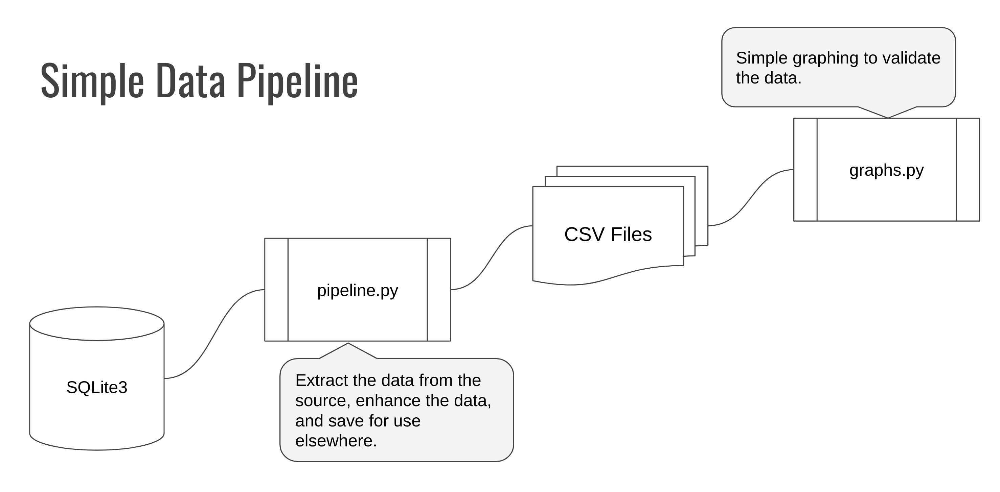

# Music Challege 2
Coding Challenge for Code Louisville Data Analysis 2 Course. The goal of this challenge is to get hands-on practice with using SQL from a Python script.

## Introduction

 The starting point for this exercise a simple data pipeline that is used to extract sales information from a database and prepare it for use in dashboard reports. In this challenge you will be adding features to the existing data pipeline. 

 

 `pipeline.py` Steps
 
 1. Extract music sales data
 1. Enhance the data with Year and Month columns
 1. Save the data as a CSV file for use in reporting

 In addition to the `pipeline.py` file, there is also a `graphs.py` file that shows some simple graphing of the data in the CSV files.

## Existing pipeline.py Functions

- `get_connection()` returns a connection to the database
- `'get_sales()` returns a Pandas DataFrame with all of the tracks sold including Year, Month, Artist Name, Album Title, Track Name, Quantity, Revenue
- `get_sales_by_artist()` takes an ArtistId as a parameter and returns a Pandas DataFrame with all of the tracks sold by the specified artist including Year, Month, Artist Name, Album Title, Track Name, Quantity, UnitPrice
- `save_sales()` takes a Pandas DataFrame as input and saves the sales data to a CSV file
- `save_sales_by_artist()` saves the sales by artist data to a CSV file
- `main()` main function for the pipeline which runs the pipeline steps

## Challenges
### Challenge 1: Add Genres to the `get_sales()` function
- Update the `get_sales()` function in `pipeline.py` to also include Genre in the returned Python DataFrame.
- The resulting DataFrame should include Year, Month, Artist Name, Album Title, Track Name, Genre, Quantity, Revenue

### Challenge 2: Add Sales by Genre
- add a new function to `pipeline.py` called `get_sales_by_genre()` that takes a GenreId and returns a dataframe with all of the tracks sold from the specified Genre 
- The resulting Dataframe should include Year, Month, Artist Name, Album Title, Track Name, Genre, Quantity, Revenue
- add a new function to `pipeline.py` called `save_sales_by_genre()` that saves the genre-specific sales data to a CSV file called `genre_sales.csv`

### Challenge 3: Add Quarters to the `get_sales()` function

- Update the `get_sales()` function in `pipeline.py` to also include the Quarter based on the Month of sale.
- Quarters should be formatted as: 2011Q1, 2011Q2, etc.
- Tip: you calculate the Quarter in SQL or in Pandas.
    - [CASE Statements in SQL](https://mode.com/sql-tutorial/sql-case/)
    - [Calculating Quarters in Pandas](https://datascienceparichay.com/article/get-quarter-from-date-in-pandas/)

### Challenge 4: Extract Catalog Data

- Add a new function to `pipeline.py` called `get_catalog_data()` to pull out all tracks including Track Name, Artist Name, Album Title, Genre

### Bonus: Graphing 
- Update the `graphs.py` file to include a graph of sales by quarter.
- Update the `graphs.py` file to include a graph of sales by Genre.
- Update `graphs.py` to include a graph of the total number of tracks by Genre.

## Instructions

1. clone the repo
1. create a virtual environment
1. install the required libraries from requirements.txt
1. run the pipeline.py file to generate the CSV file(s)
1. run the graphs.py file to see the example graphs
1. modify the pipeline.py and graphs.py files to complete the challenges and bonus.